# Yen for the Future
## Done by Nedal Nahanweh 
## INTRODUCTION
This project is built to apply some time series tools in order to predict future movment in value of the Canadian dollar versus Japanes yen .

 `` The Starter code file  contains two main NoteBooks ``
 
* [Linear Regression Starter Notebook](https://github.com/malkawenedal/-Unit-10-A-Yen-for-the-Future/blob/main/Starter_Code/regression_analysis.ipynb). 
 .This Notebook will build a Scikit-Learn linear regression model to predict CAD/JPY returns with *lagged* CAD/JPY futures returns and categorical calendar seasonal effects.
 
 * [Time-Series Starter Notebook](https://github.com/malkawenedal/-Unit-10-A-Yen-for-the-Future/blob/main/Starter_Code/time_series_analysis.ipynb)This Notebook contains a historical CAD-JPY exchange rate data that has been used to apply time series analysis and modelling to determine if there is any predictable behaviour 
 

_________________________________________________________________________ 
 
## Linear Regression Forecasting

##### Creating Returns and lagged returns using Shift function
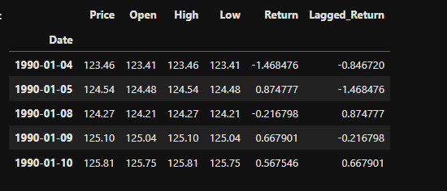

####  Making and plotting  predictions using the testing data.
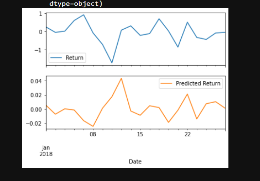

#### Conducting  the Out-of-sample and In-sample-performance 

### snippets & codes 

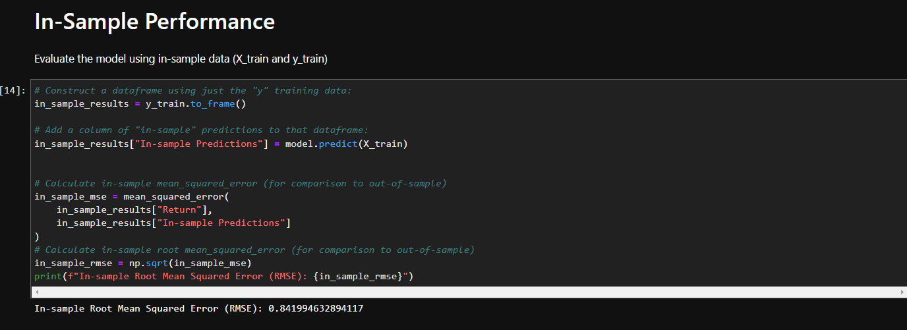
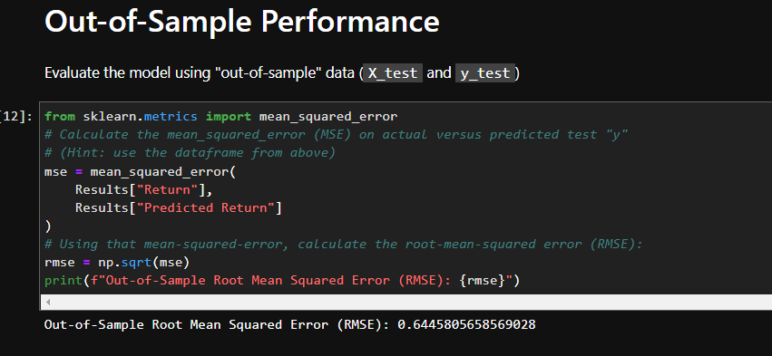

## Conclusion 

**Question:** Does this model perform better or worse on out-of-sample data as compared to in-sample data?

**Answer:** in-sample-performs performs worse than out-of-sample as its value is bigger than 0.6445805658569028.

___________________________________________________________________
______________________________________________________________________________________________________________________________________

# Time-Series Forecasting

This Notebook contains a historical CAD-JPY exchange rate data that has been used to apply time series analysis and modelling to determine if there is any predictable behaviour 
 
#### Plotting the Settle price to check for long or short-term patterns
 
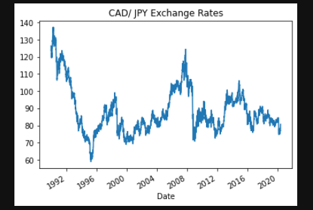

looking at the plot is enough to make us relise that, there is a noticable downword trend from 1992 to 1995 , couple spikes at 1998,2008,2014 and 2015.
 
### plotting the Exchange Rate Price VS the Trend for 2015 to the present. 
to get  a better idea about how the trend behaves
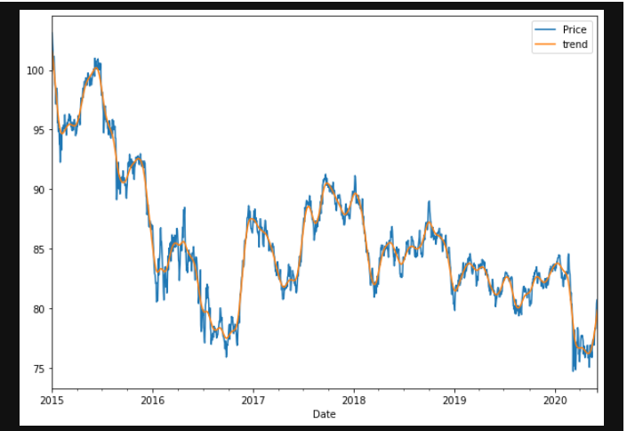

## Forecasting Returns using an ARMA Model
Output model summary results:

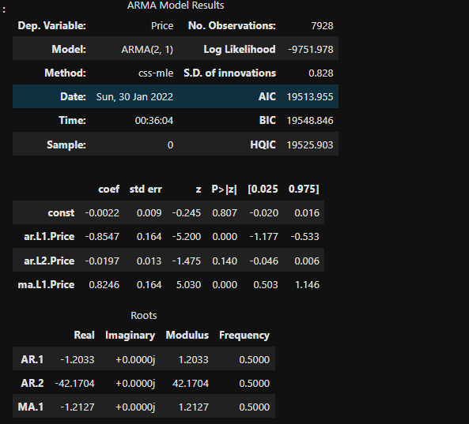

### Plot the 5 Day Returns Forecast

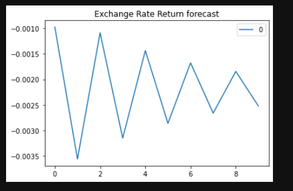

## Forecasting the Exchange Rate Price using an ARIMA Model
Output model summary results:
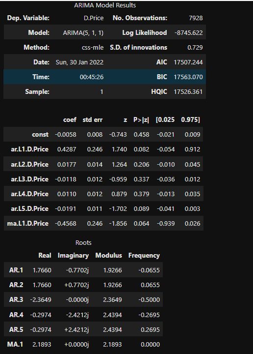
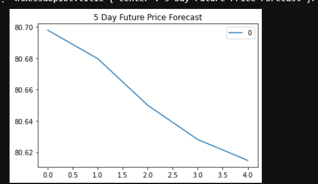

## Volatility Forecasting with GARCH
Output model summary results:
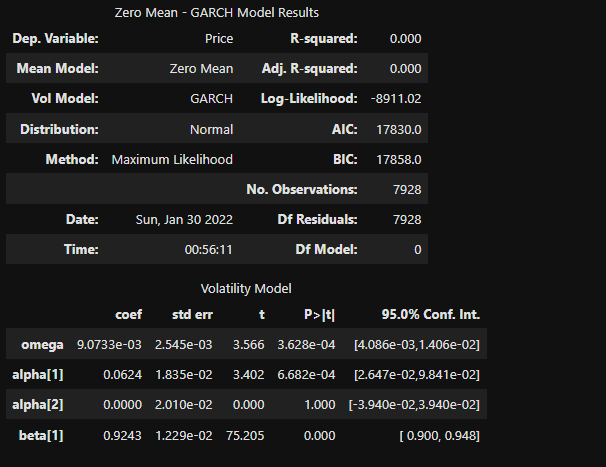
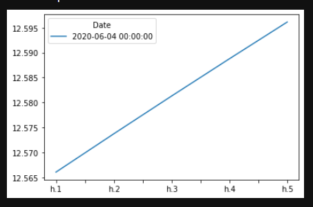

## Conclusions
Based on the time series analysis , it is not encourging to buy the yen now as it is expected to go down as well as the the risk is exppected to increase .  

